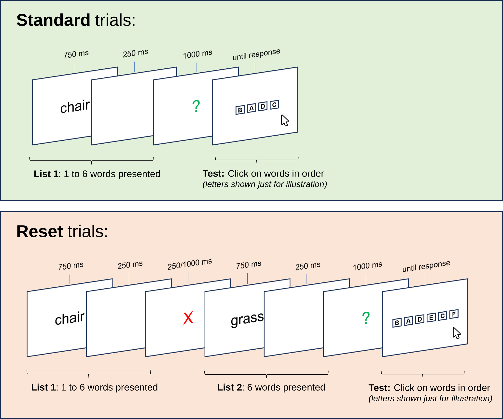
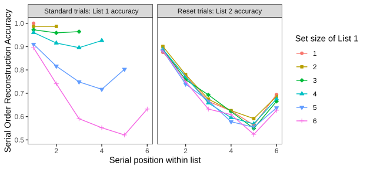
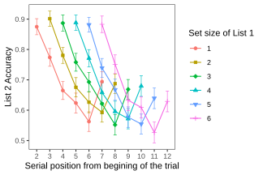
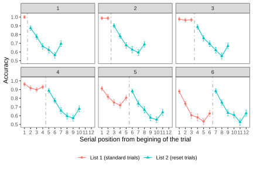
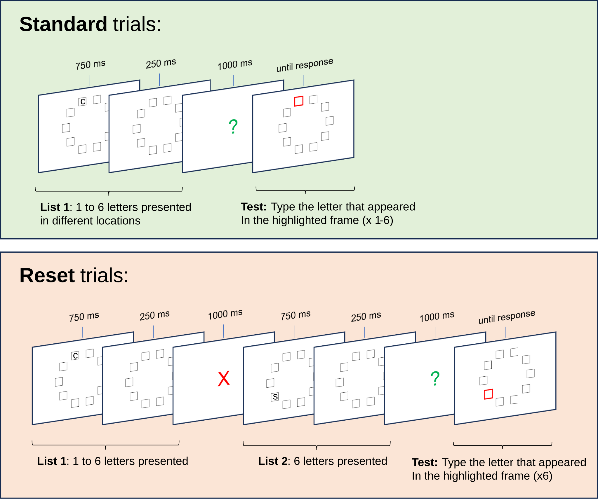
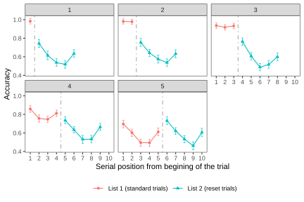
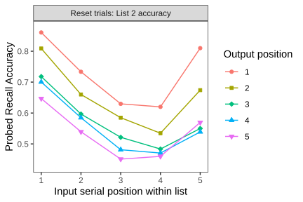

# Cognitive resources can be intentionally released when processed information becomes irrelevant: Insights from the primacy effect in working memory

Vencislav Popov

Department of Psychology, University of Zurich, Switzerland

Correspondence concerning this article should be addressed to Vencislav Popov, Department of Psychology, University of Zurich,  Binzmühlestrasse 14/22, 8050 Zurich, Switzerland. Email: (<vencislav.popov@gmail.com>).

The experimental software, data and analysis code for all experiments are freely available at: <https://github.com/venpopov/primacy-reset>. This research was supported by a grant from the Swiss National Science Foundation to K. Oberauer (project [100014_192204](https://www.mysnf.ch/grants/grant.aspx?id=352ef64b-3fa7-4f88-95e3-90514464c984)). I declare no conflicts of interest. I used ChatGPT to shorten the manuscript by ~20% to fit journal guidelines and to generate an abstract based on the final draft, which I then edited to ensure it accurately represents the content of the article.

This paper is written as a fictional dialogue between me (VP) and an imaginary colleague (IC) who is a psychological scientist specializing in a different field. The aim of this format is not novelty for novelty’s sake, but rather to communicate these findings to a broad scientific audience in an engaging way.

## Abstract

Processing information depletes a limited cognitive resource. This resource can recover passively over time, but an open question remains: if resources are spent to process information that soon becomes irrelevant, are these resources immediately released? I present an analysis of the Source of Activation Confusion (SAC) model of human memory and its ability to explain the primacy effect in working memory – the tendency for items at the beginning of a list to be better remembered than those in the middle or end. The SAC model attributes the primacy effect to a limited resource pool that is depleted during the encoding of each item into memory, with resource recovery happening passively over time. The model's core mechanisms are challenged by two experiments that reveal the primacy effect can be reset with the application of a forget signal, suggesting resource recovery is not entirely passive. This means that either the passive resource recovery assumption needs to be reformulated, or that the primacy effect is not a result of resource depletion. Given the broad range of other findings the model can explain, abandoning it is premature. Instead, I propose that in addition to recovering passively over time, memory resources can be manually released when the information encoded with them is no longer relevant. This reformulation is important because it significantly limits the range of possible substrates for the proposed resource. I discuss implications for related theories and phenomena such as ego depletion.

*Keywords*: Source of Activation Confusion Model, Primacy Effect, Working Memory, Resource Depletion, Ego Depletion

## Introduction

**VP**[^1]**:** I want to tell you about two experiments that contradict a key mechanism in the Source of Activation Confusion model of memory (SAC; Popov & Reder, 2020). Are you familiar with the primacy effect?

**IC:** It is a textbook finding – memory for a list of items gradually decreases with their position on the list (Jahnke, 1963; Murdock, 1962; Oberauer, 2003). What makes this effect interesting to study?

**VP:** The primacy effect is a key target for explanation in working memory (Oberauer et al., 2018). This is due to three reasons. First, it is general - it appears across many tasks (Oberauer, 2003), and despite individual differences, almost all participants show it. Second, its size is substantial - while it can vary with other factors, accuracy can differ by as much as 80% between the best and worst recalled item. Finally, the magnitude of the effect interacts with many other variables such as presentation rate (Oberauer, 2022), word-frequency (Popov & Reder, 2020) and test type (Oberauer, 2003). This makes it challenging for memory models to capture the full pattern.

**IC:** I understand – these factors make the primacy effect diagnostic for memory models, helping us distinguish between them.

**VP:** Precisely. If a memory model fails to account for aspects of the primacy effect, there is something wrong with one of its key mechanisms.

**IC:** You mentioned the SAC model of memory. Does it explain the primacy effect?

**VP:** Yes, simulations have shown that it captures many aspects of the effect – it becomes steeper with faster presentation rates and with less familiar stimuli. SAC also captures individual differences in the steepness of the primacy gradient and predicts associated EEG data during encoding. It explains these effects through three key mechanisms: 1) Storing information in memory depletes a proportion of a limited resource pool; 2) less familiar items deplete more resources; and 3) the limited resource recovers gradually over time. There are other proposed mechanisms of the primacy effect, but the resource-depletion-and-recovery is among the most promising (Oberauer, 2022)

**IC**: Can you elaborate how these mechanisms account for the primacy effect?

**VP:** Imagine a memory list of 5 items, presented one at a time at a rate of 1 per second. Assume that the total amount of resources is 1, that each item depletes 25% of the resources, and that resources recover at a rate of 10% per second. The first item will deplete 0.25\*1=0.25 resources, leaving 0.75 resource available. When the second item appears, the resource would have recovered by 0.10\*1s = 0.1, resulting in 0.85 resources available. Repeating the same calculations tell us that the second item would deplete 0.21 resources and the third – 0.185 resources (0.164 and 0.148 for the fourth and fifth items, respectively). Because memory strength is proportional to the amount of resource used to create it, the probability of recalling an item decreases gradually with serial position. When items appear faster, there is less time for resource to recover between item presentations, causing a steeper primacy gradient (Oberauer, 2022). Similarly, less familiar items, for example low-frequency words, deplete a greater proportion of the resource, also leading to a steeper primacy gradient (Popov & Reder, 2020). Finally, individual differences in the primacy effect can be captured by different parameter values, and these parameters predict individual differences in an EEG signal during encoding, which was recently interpreted as a measure of resource availability (Ma et al., 2022).

**IC:** Sounds like SAC does a good job. What is the problem?

**VP:** According to the current model, people can control how much resources they spend, but they cannot control the resource recovery – resources recover passively over time. Once a proportion of the resources is depleted, the only thing that can replenish them is time. The experiments I will describe show unequivocally that this is incorrect and that either the primacy effect is not due to resource depletion, or that the resource can be manually released. That means that either the model must be discarded or that its recovery assumption should be reformulated.

**IC**: How did you reach this conclusion?

**VP:** Imagine that I give you a list of words to remember. After a variable number of items (1-6), you either receive a memory test for these items, or a brief signal telling you to ignore the items you just saw. In the latter case, 6 more items are presented, and your memory is tested only for the new items (Figure 1). The time between the irrelevant first list and the second list is very short (250 ms) to prevent resource recovery. What do you think the model would predict?

**IC:** Based on what you told me, I expect that a longer first list would leave less resources available, leading to worse memory for the second list.

**VP:** Exactly! If resources cannot be released manually, then memory for the first item in List 2 should be equivalent to memory for item X+1 in a single list, where X is the length of the irrelevant first list. As the first list gets longer, the serial position curve of List 2 should be progressively shifted down. As it turns out, this is not the case – after the reset signal, the primacy effect is completely reset.

## Experiment 1 – Serial Order Reconstruction

### Method

#### Participants

A total of 200 native English speakers aged 18-30 were recruited online via Prolific. All experiments were conducted in accordance with the guidelines issued by the Ethics Committee of the Faculty of Arts and Social Science, University of Zurich. All participants agreed with an Informed Consent statement at the beginning of each experiment. At the end of the experiment, participants responded to two questions: 1) Did you use any external help (e.g. pen and paper) to remember information? 2) Did you perform the task diligently? If not, we will not use your data for scientific analysis. Participants were ensured that their compensation would not be affected by their answer and that they should respond honestly. The data for four participants was not transmitted from Prolific due to an unknown error. Two participants were excluded because they responded “Yes” to the first question, and one participant was excluded because they responded “No” to the second question. One participant was excluded because their accuracy on the second list was indistinguishable from chance (20.8%, whereas a bootstrapping simulation revealed that chance accuracy is 16.6% with 95% probability within 9.9-23.4%). Three additional participants were excluded because their accuracy on the first list was indistinguishable from chance (35-42.5%) whereas a bootstrapping simulation[^2] revealed that chance accuracy is 29.0% with 95% probability within 15.3-42.8%). These exclusion criteria were established prior to data collection and did not affect the results. The final sample contained 188 participants.

#### Procedure

Participants performed 6 practice and 48 experimental trials of an immediate order reconstruction task (see Figure 1) programmed in *lab.js* (Henninger et al., 2019). Each began with a fixation cross, and participants had to press space to begin the trial. Afterwards, words were presented one at a time in the middle of the screen for 750 ms, separated by a blank interval of 250 ms. There were two types of trials – standard and reset trials. During standard trials, variable number of words (1 to 6) were presented for study, followed by a green question mark for 1000 ms. The question mark indicated that memory for the items just presented will be tested. During the test, all presented words appeared together horizontally in random order, and participants had to click on the words in the order in which they were presented during study.

**Figure 1**. Illustration of Experiment 1’s procedure. Note that on the test screen 1 to 6 words were presented, but due to space constraints, the figure illustrates this with letters.

During reset trials, after the first 1 to 6 items were presented, a red X appeared for either 250 ms (97 participants) or 1000 ms (92 participants; the duration was manipulated between-subjects). Participants were instructed that items appearing before the red X were irrelevant and will not be tested. The red X was immediately followed by 6 new items and a green question mark, followed by the same serial order reconstruction task, limited to the 6 new items. The items preceding the red X were not tested. Thus, trials consisted of two types of lists – List 1 with a variable number of items (1-6) and List 2 with a fixed number of items (6). Standard trials displayed only List 1, while reset trials displayed both lists, but tested memory only for List 2 items. Even though the key analyses focus on reset trials, standard trials were necessary to ensure that participants encoded all List 1 items.

#### Materials and design

For each participant, 12 words were randomly selected from a pool of 180 concrete high-frequency nouns used by Popov and Dames (2022). These 12 words were reused on each trial, thus forming a closed pool for each participant. Since trials were composed of 6-12 items, a random subset of the 12 words were selected and their order was randomized across trials.

The experiment used a 2x6x2 mixed design – trial type (standard vs reset; within-subjects), number of items on List 1 (1-6; within-subjects), and duration of the reset cue (250 ms vs 1000 ms; between-subjects). The order of trial type and the number of items on List 1 were randomized across participants, with 4 trials for each combination of factors. The reset cue duration had no significant effect on any results, thus for simplicity all reported results collapse over this between-subject factor.

### Results

The results are shown in Figures 2-4. In standard trials, participants reconstructed the order of one to six words, a typical immediate working memory task. It demonstrated a standard serial position and set size effects (Oberauer, 2003) (Figure 2, left), serving as a sanity check. Despite expecting List 1 to become irrelevant on half of the trials, participants still memorized it, and their resources should have been depleted proportionately to the set size.

The key finding concerns List 2 performance on Reset trials. If the primacy effect is solely due to resource depletion, and if the resource recovers passively over time, List 2 should be greatly influenced by List 1's set size. However, as Figure 2 (right) indicates, this was not the case. Although a statistically significant effect was observed (ΔAIC = -6, χ2 = 7.94, p = 0.005), it was minimal compared to the set size effect on List 1 performance. Figure 3 further illustrates this, presenting the same data from the right panel of Figure 2 but based on the absolute serial position since the start of the trial. The absolute serial position within the trial has little impact; rather, it is the relative serial position within List 2 that determines performance.

**Figure 2.** Serial order reconstruction accuracy in Experiment 1 as a function of trial type (standard vs reset trials), serial position within list (1-6) and the set size of List 1. Error bars represent 95% within-subject confidence intervals (Cousineau, 2005; Morey, 2008).

The resource depletion account predicts a smooth, continuous curve over absolute serial positions – the fact that a reset signal has appeared should not affect the available resources, and performance should continue to drop. However, a distinct "resetting effect" can be observed (dashed line in Figure 4). Once the reset signal appears, memory for the first item in List 2 returns to the same level, regardless of List 1's length. Figure 4 demonstrates this by plotting performance for both lists as if they were a single list, even though they were never tested together. This effect contradicts the predictions of the SAC model without the need for inferential statistics. It appears that List 1 was mostly purged from working memory, aligning with recent findings on directed forgetting in working memory (Dames & Oberauer, 2021; Lewis-Peacock et al., 2018; Oberauer, 2018).

**Figure 3.** Accuracy in List 2 in Experiment 1 as a function of serial position relative to the start of the trial. Error bars represent 95% within-subject confidence intervals (Cousineau, 2005; Morey, 2008).

## Experiment 2 – Random Order Probed Recall

**Figure 4.** Accuracy in Experiment 1 as a function of the absolute serial position since the beginning of a trial (x-axis), and the set size of List 1 (different panels). The dashed line in each panel represents the timing of the reset screen. Note that standard and reset trials were tested separately – even though the data is displayed together in one panel, a memory test never tested items from both lists. Error bars represent 95% within-subject confidence intervals (Cousineau, 2005; Morey, 2008).

One issue with Experiment 1 is that input and output positions were confounded. Words presented first were expected to be clicked on first, which can lead to performance decline due to output interference (Criss et al., 2011; Oberauer, 2003). Previous studies show that primacy effects occur even when input and output positions are dissociated (Oberauer, 2003). However, Experiment 1's resetting may be solely due to the absence of output interference since List 1 was never tested. Experiment 2 aimed to replicate the results of Experiment 1 without this confound by using a random probe memory task with letters presented in different spatial positions. At test, a random position was highlighted and participants had to respond with the item presented in the highlighted position during study, allowing evaluation of the primacy effect independently of the testing order (Figure 5).

### Method

#### Participants

A total of 100 native English speakers aged 18-30 were recruited via Prolific. The data for six participants was not transmitted from Prolific due to an unknown error. Two participants were excluded because they responded “Yes” to the “Did you use external help?” question, and one participant was excluded because they responded “No” to the “Did you perform the task diligently?” question. Chance level is difficult to evaluate in this task, therefore only two participants who performed extremely poorly (~19% correct, relative to 46% for the next best participant) were excluded. These exclusions had no effect on the results. The final sample contained 89 participants.

#### Procedure, materials, and design

The procedure was identical to Experiment 1, except for the following changes (see Figure 5). The maximum length of List 1 was reduced to 5 items, and the length of List 2 was also reduced to 5 items. Latin consonants (B, C, D, F, G, J, K, L, M, N, P, Q, S, T, V, X, Z) were presented instead of words. Ten empty square frames arranged in a circle were shown at the beginning of each trial. Each letter appeared in one random frame location. A letter always appeared in one of the previously unused during the list frames. The number of experimental trials was increased to 60, and the between-subject manipulation of the reset duration was eliminated – the reset duration was 250 ms for all participants.

**Figure 5**. Illustration of the procedure for Experiment 2. During test, frames were highlighted in a random order.

The test was replaced with a random order probed recall (Oberauer, 2003). After the green question mark appeared, one of the frames in which a letter had appeared was highlighted at random and participants had to type the letter they had seen in the highlighted box. After their response was recorded, another frame was highlighted at random, and this process continued until all items from List 1 (in the standard condition) or List 2 (in the reset condition) were tested.

### Results

All results were identical to Experiment 1. A primacy effect of similar magnitude occurred on both standard and reset trials even though input and output position were dissociated (Figure 6). More importantly, the primacy effect was reset just as well as in Experiment 1, suggesting that this was not due to a confound with output position[^3]. In contrast to Experiment 1, the small effect of List 1 set size was not even significant, ΔAIC = 0, χ2 = 2.14, *p* = 0.14.

**Figure 6.** Accuracy in Experiment 2 as a function of the absolute serial position since the beginning of a trial (x-axis), and the set size of List 1 (different panels). The dashed line in each panel represents the timing of the reset screen. Note that standard and reset trials were tested separately – even though the data is displayed together in one panel, a memory test never tested items from both lists. Error bars represent 95% within-subject confidence intervals (Cousineau, 2005; Morey, 2008).

## General Discussion

**VP:** Both experiments show that a brief signal can completely reset the primacy effect in working memory. Participants seem to clear their working memory when they learn that the first list is irrelevant, which prevents interference with new information. This is consistent with other recent results showing that participants can selectively remove information from working memory (Dames & Oberauer, 2021; Lewis-Peacock et al., 2018; Oberauer, 2018).

**IC:** Agreed. Figure 4 and Figure 6 are particularly noteworthy – it is as if the list before the reset signal was never presented. Maybe participants did not learn List 1 because on half of the trials it would be a waste of time and cognitive resources?

**VP:** Unlikely. If that were the case, memory for List 1 on standard trials would be much worse. In both experiments, participants showed typical memory effects for List 1, including overall memory, set size, and serial position effects. Comparing set size 6 List 1 and List 2, there was little difference, indicating participants tried to remember both lists.

**IC:** You mentioned these results contradict the current SAC memory model. Does this mean we should discard the resource-based explanation of the primacy effect?

**VP:** That would be premature. SAC is currently the only model that can account for the full range of frequency effects in memory and their interactions with many experimental variables (Popov & Reder, 2020). It also explains many aspects of the primacy effect, presentation rate effects, list-composition effects, semantic similarity effects and item-method directed forgetting (Kowialiewski et al., 2021; Mizrak & Oberauer, 2021; Oberauer, 2022; Popov et al., 2019, 2021; Popov & Reder, 2020) . Although it has other mechanisms, the resource depletion and recovery ones are crucial for its ability to account for almost all effects above. The issue is that the model lacks a mechanism to intentionally release already used resources. Adding a control parameter could easily address this, releasing resources when items become irrelevant or when they are consolidated, as suggested by Oberauer (2022). While this adjustment is mathematically trivial, it substantially changes the interpretation of the resource depletion process.

**IC:** How so?

**VP:** We have previously used a physical analogy – that encoding information in memory and binding it to its context depletes a limited resource in much the same way that physical actions deplete substrates in the muscle fibers (Popov & Reder, 2020). The equations are not committed to this analogy, but from the results presented here it is clear that this analogy has no substance – if the underlying resource was a limited metabolic quantity that gets used up by processing (like glucose, oxygen or ATP), then the resetting would have been unsuccessful. These results suggest that if the resource exists, it is more likely to be 1) some higher level property of neural networks or 2) a substrate that does not get used up, but instead becomes temporarily blocked. I find it unlikely, but it is also possible that the resource mechanism is fundamentally incorrect, which would require us to build a new explanation for many of the other phenomena it explains.

**IC:** The analogy you mentioned reminds me of the ego depletion effect - self-control actions make it harder to apply self-control again in the near future (Baumeister et al., 1998). The strength model of ego-depletion uses the same analogy to suggest that self-control is a depletable resource that needs time to recover (Muraven & Baumeister, 2000). However, subsequent research showed that either the finding does not exist (Carter et al., 2015), or that if it does, it is not due to resource depletion, since it can be reset by various manipulations (Inzlicht & Schmeichel, 2012; Job et al., 2010). What are your thoughts on the SAC model in relation to ego depletion?

**VP:** Originally, we distanced the SAC model from ego depletion because of its replication failures (Popov & Reder, 2020). In contrast to the strength model of ego depletion, which is a verbal theory, SAC is a formal computational model supported by quantitative fits to diverse datasets. We believed the resource in SAC is specific to memory operations, but now I am not so sure. We recently proposed that the resource in the SAC model underlies not only memory operations, but general cognitive processing, explaining findings like the cognitive load effect (Greeno et al., 2022). While this proposal helps extend the application of the model, the recent replication failures of the ego-depletion effect made me uneasy. The current results suggest a novel possibility – the resource in question may be more controllable than previously assumed. If the resource can be manually released, this might explain the instability of sequential effects in ego depletion tasks.

Another reason for replication difficulties might be the design and limited observations in typical ego depletion studies. These studies use between-subject designs with often just one observation per participant (i.e., participants first complete either a resource demanding or a control task, followed by a second task minutes later). One of the strongest support for the SAC’s resource mechanism comes from similar sequential effects of word-frequency on list memory (Popov & Reder, 2020). Memory for words that following low-frequency words on a list is worse relative to words that follow high-frequency words. This relatively small effect (~5%), requires hundreds of trials per participant to detect, but we have replicated many times. Finally, fits to multiple datasets estimate a full recovery time of 3 to 12 seconds (in rare cases, up to 20 seconds). This is far shorter than the free time used in most ego-depletion studies.

**IC:** Final question. If I understood the SAC model correctly, it claims that the primacy effect is entirely due to resource depletion. Is it possible that other non-resource mechanisms contribute to it, and is the data you showed relevant to this question?

**VP:** Yes, in its current version the SAC model attributes the primacy effect entirely to resource depletion and with the exception of the current findings I had no reason to suppose otherwise. Nevertheless, I have always considered this to be a mathematical simplification, and indeed the initial motivation for the current experiments was not to test if the primacy effect can be reset, but rather to isolate the part of the primacy effect that was due to resource depletion. Specifically, I wanted to remove contributions of other potential explanations for the primacy effect such as the more frequent rehearsal of early list items (Tan & Ward, 2000) or the higher distinctiveness of the initial list context (Brown et al., 2007). My reasoning was that if List 1 exerted a negative effect on List 2 recall, proportional to its set size, this cannot be due to either of those mechanisms, because List 1 becomes irrelevant. Then, I could fit the model and estimate the resource depletion and recovery rates without contamination by other mechanisms. I was surprised to find that after the reset signal List 1 had no negative effect on List 2.

Both the rehearsal-based and the distinctiveness-based account are consistent with the current findings, but they face many other problems (e.g. Lewandowsky & Oberauer, 2015; Oberauer, 2003). A final possibility, common in other working memory models is that of an attentional gradient (Farrell & Lewandowsky, 2002; Oberauer & Lin, 2023; Page & Norris, 1998; Polyn et al., 2009). These models assume that people pay most attention to the first item on a list and that attention decreases with each subsequent item. This is usually implemented as an attentional parameter that downgrades the strength of memory traces as a function of serial position. The primacy gradient is quite similar to the resource-based account in its effects, but it is not based on a specific cognitive mechanism – it is a convenient way to fit the data, but it lacks an explanation for why attention decreases across serial positions. The resource-based account can be considered as the mechanism that gives rise to the attentional primacy gradient. In summary, this is why I consider it premature to abandon the SAC model and its resource-based account – it has been too successful until now, and there is no alternative mechanistic explanation that provides a satisfying account of all the data. Which takes us back to the beginning of this article – despite its status as a textbook finding, the primacy effect continues to be a fundamental challenge for models of episodic and working memory. Most other state-of-the-art models use an attentional gradient due to its flexibility, but ideally we need a better fleshed out mechanism that is more than a mathematical convenience. This is where resource-depletion comes in – rather than being a parameter specifically designed to account just for the primacy effect, it arises from the basic functionality of the model, and it is used to account for many different findings in episodic and working memory. However, as the data here showed, this mechanism also requires further study and adjustement.

## Open Practices Statement

This study was not preregistered. The experimental software, data and analysis code for all experiments are freely available at: <https://github.com/venpopov/primacy-reset>.

## Supplemental Materials

**Figure S1.** Input vs output position effects on List 2 performance in Experiment 2. Error bars represent 95% within-subject confidence intervals (Cousineau, 2005; Morey, 2008).

## References

Baumeister, R. F., Bratslavsky, E., Muraven, M., & Tice, D. M. (1998). Ego depletion: Is the active self a limited resource? *Journal of Personality and Social Psychology*, *74*(5), 1252–1265.

Brown, G. D., Neath, I., & Chater, N. (2007). A temporal ratio model of memory. *Psychological Review*, *114*(3), 539.

Carter, E. C., Kofler, L. M., Forster, D. E., & McCullough, M. E. (2015). A series of meta-analytic tests of the depletion effect: Self-control does not seem to rely on a limited resource. *Journal of Experimental Psychology: General*, *144*, 796–815. https://doi.org/10.1037/xge0000083

Cousineau, D. (2005). Confidence intervals in within-subject designs: A simpler solution to Loftus and Masson's method. *Tutorials in Quantitative Methods for Psychology*, *1*(1), 42–45. https://doi.org/10.20982/tqmp.01.1.p042

Criss, A. H., Malmberg, K. J., & Shiffrin, R. M. (2011). Output interference in recognition memory. *Journal of Memory and Language*, *64*(4), 316–326. https://doi.org/10.1016/j.jml.2011.02.003

Dames, H., & Oberauer, K. (2021). *Directed-Forgetting in Working Memory*. PsyArXiv. https://doi.org/10.31234/osf.io/93cru

Farrell, S., & Lewandowsky, S. (2002). An endogenous distributed model of ordering in serial recall. *Psychonomic Bulletin & Review*, *9*(1), 59–79. https://doi.org/10.3758/BF03196257

Greeno, D., Morey, C., & Popov, V. (2022). Preregistration report: An adversarial collaboration contrasting two explanations for the effect of working memory load on distractor processing during encoding and retention. *OSF*.

Henninger, F., Shevchenko, Y., Mertens, U., Kieslich, P. J., & Hilbig, B. E. (2019). *lab.js: A free, open, online study builder*. PsyArXiv. https://doi.org/10.31234/osf.io/fqr49

Inzlicht, M., & Schmeichel, B. J. (2012). What Is Ego Depletion? Toward a Mechanistic Revision of the Resource Model of Self-Control. *Perspectives on Psychological Science: A Journal of the Association for Psychological Science*, *7*(5), 450–463. https://doi.org/10.1177/1745691612454134

Jahnke, J. C. (1963). Serial position effects in immediate serial recall. *Journal of Verbal Learning and Verbal Behavior*, *2*(3), 284–287. https://doi.org/10.1016/S0022-5371(63)80095-X

Job, V., Dweck, C. S., & Walton, G. M. (2010). Ego depletion--is it all in your head? Implicit theories about willpower affect self-regulation. *Psychological Science*, *21*(11), 1686–1693. https://doi.org/10.1177/0956797610384745

Kowialiewski, B., Lemaire, B., & Portrat, S. (2021). How does semantic knowledge impact working memory maintenance? Computational and behavioral investigations. *Journal of Memory and Language*, *117*, 104208.

Lewandowsky, S., & Oberauer, K. (2015). Rehearsal in serial recall: An unworkable solution to the nonexistent problem of decay. *Psychological Review*, *122*(4), 674–699. https://doi.org/10.1037/a0039684

Lewis-Peacock, J. A., Kessler, Y., & Oberauer, K. (2018). The removal of information from working memory. *Annals of the New York Academy of Sciences*, *1424*(1), Article 1. https://doi.org/10.1111/nyas.13714

Ma, S., Popov, V., & Zhang, Q. (2022). A Neural Index Reflecting the Amount of Cognitive Resources Available during Memory Encoding: A Model-based Approach. *BioRxiv*.

Mizrak, E., & Oberauer, K. (2021). What is time good for in working memory? In *Psychological Science*. https://doi.org/10.31234/osf.io/ahqwj

Morey, R. D. (2008). Confidence intervals from normalized data: A correction to Cousineau (2005). *Tutorials in Quantitative Methods for Psychology*, *4*(2), 61–64. https://doi.org/10.20982/tqmp.04.2.p061

Muraven, M., & Baumeister, R. F. (2000). Self-regulation and depletion of limited resources: Does self-control resemble a muscle? *Psychological Bulletin*, *126*(2), 247–259. https://doi.org/10.1037/0033-2909.126.2.247

Murdock, B. B. (1962). The serial position effect of free recall. *Journal of Experimental Psychology*, *64*(5), 482.

Oberauer, K. (2003). Understanding serial position curves in short-term recognition and recall. *Journal of Memory and Language*, *49*(4), 469–483. https://doi.org/10.1016/S0749-596X(03)00080-9

Oberauer, K. (2018). Removal of irrelevant information from working memory: Sometimes fast, sometimes slow, and sometimes not at all: Removal of irrelevant information from working memory. *Annals of the New York Academy of Sciences*, *1424*(1), 239–255. https://doi.org/10.1111/nyas.13603

Oberauer, K. (2022). When does working memory get better with longer time? *Journal of Experimental Psychology. Learning, Memory, and Cognition*, *48*(12), 1754–1774. https://doi.org/10.1037/xlm0001199

Oberauer, K., Lewandowsky, S., Awh, E., Brown, G. D. A., Conway, A., Cowan, N., Donkin, C., Farrell, S., Hitch, G. J., Hurlstone, M. J., Ma, W. J., Morey, C. C., Nee, D. E., Schweppe, J., Vergauwe, E., & Ward, G. (2018). Benchmarks for models of short-term and working memory. *Psychological Bulletin*, *144*(9), 885–958. https://doi.org/10.1037/bul0000153

Oberauer, K., & Lin, H.-Y. (2023). *An interference model for visual and verbal working memory*. PsyArXiv. https://doi.org/10.31234/osf.io/eyknx

Page, M. P. A., & Norris, D. (1998). The primacy model: A new model of immediate serial recall. *Psychological Review*, *105*(4), 761–781. https://doi.org/10.1037/0033-295X.105.4.761-781

Polyn, S. M., Norman, K. A., & Kahana, M. J. (2009). A context maintenance and retrieval model of organizational processes in free recall. *Psychological Review*, *116*(1), 129.

Popov, V., & Dames, H. (2022). Intent matters: Resolving the intentional versus incidental learning paradox in episodic long-term memory. *Journal of Experimental Psychology: General*. https://doi.org/10.1037/xge0001272

Popov, V., Marevic, I., Rummel, J., & Reder, L. M. (2019). Forgetting Is a Feature, Not a Bug: Intentionally Forgetting Some Things Helps Us Remember Others by Freeing Up Working Memory Resources. *Psychological Science*, *30*(9), 1303–1317. https://doi.org/10.1177/0956797619859531

Popov, V., & Reder, L. M. (2020). Frequency effects on memory: A resource-limited theory. *Psychological Review*, *127*(1), 1–46. https://doi.org/10.1037/rev0000161

Popov, V., So, M., & Reder, L. M. (2021). Memory resources recover gradually over time: The effects of word frequency, presentation rate, and list composition on binding errors and mnemonic precision in source memory. *Journal of Experimental Psychology. Learning, Memory, and Cognition*. https://doi.org/10.1037/xlm0001072

Tan, L., & Ward, G. (2000). A recency-based account of the primacy effect in free recall. *Journal of Experimental Psychology: Learning, Memory, and Cognition*, *26*(6), 1589.

[^1]: This paper is written as a fictional dialogue between me (VP) and an imaginary colleague (IC) who is a psychological scientist specializing in a different field. The aim of this format is not novelty for novelty’s sake, but rather to communicate these findings to a broad scientific audience in an engaging way.

[^2]: Note that the first list had variable number of items (see the procedure), which made the bootstrap simulation necessary to calculate chance level.

[^3]: As in Oberauer (2003), input and output position had independent effects and performance decreased with increasing both positions. See Figure S1 in the supplemental materials.
